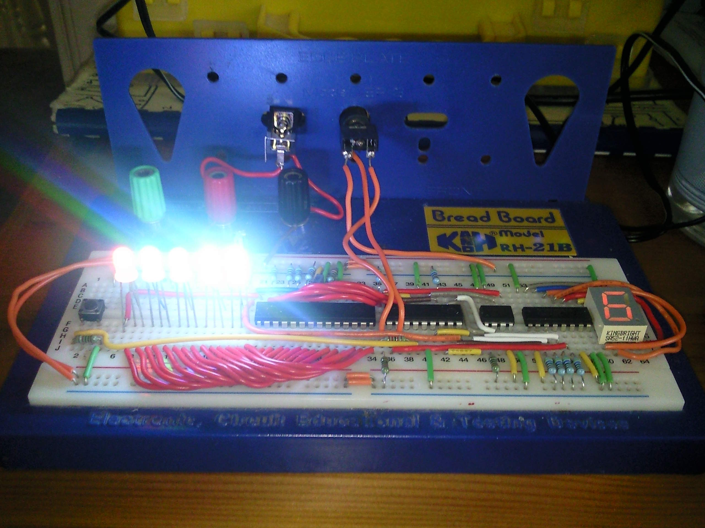

# RGB LED Sequencer and C#.NET Library
[![GitHub tag][GitHubTagImage]][GitHubTagUrl]
[![AppVeyor master][AppVeyorImage]][AppVeyorUrl]
[![Coveralls master][CoverallsImage]][CoverallsUrl]
[![license][LicenceImage]][LicenceUrl]

## RGB LED Sequencer
The RGB LED Sequencer (RgbLedS) is a 5 RGB LED electronic circuit, controlled by a
[PICAXE 18M2](http://www.picaxe.com/What-Is-PICAXE), which allows up to 10 user programmed light
sequences to be saved and played back. Sequences are sent to the device via serial communication and
each sequence may have up to 770 steps each with its' own specified delay time before the next step.
A user may press a button on the device which will cycle between the 10 currently programmed
sequences; holding this button down for more than ~2.5 seconds will send the device into sleep
(low power) mode - pressing the button again or receiving a command signal via serial will wake the
device again.

## RGB LED Sequencer Library [![RgbLedSequencerLibrary NuGet][RgbLedSequencerLibraryNuGetImage]][RgbLedSequencerLibraryNuGetUrl]
The RGB LED Sequencer Library (RgbLedSLi) is a C#.NET Class Library which provides an easy to use
interface to communicate with the RGB LED Sequencer via COM Port (for the PICAXE, this is usually
achieved using an [AXE027](http://www.picaxe.com/Hardware/Cables/PICAXE-USB-Download-Cable) cable).

[GitHubTagImage]: https://img.shields.io/github/tag/natsnudasoft/RgbLedSequencer.svg?maxAge=300&style=flat-square
[GitHubTagUrl]: https://github.com/natsnudasoft/RgbLedSequencer
[AppVeyorImage]: https://img.shields.io/appveyor/ci/natsnudasoft/RgbLedSequencer/master.svg?maxAge=300&style=flat-square
[AppVeyorUrl]:  https://ci.appveyor.com/project/natsnudasoft/RgbLedSequencer/branch/master
[CoverallsImage]: https://img.shields.io/coveralls/natsnudasoft/RgbLedSequencer/master.svg?maxAge=300&style=flat-square
[CoverallsUrl]: https://coveralls.io/github/natsnudasoft/RgbLedSequencer?branch=master
[RgbLedSequencerLibraryNuGetImage]: https://img.shields.io/nuget/v/RgbLedSequencerLibrary.svg?style=flat-square
[RgbLedSequencerLibraryNuGetUrl]: https://www.nuget.org/packages/RgbLedSequencerLibrary
[LicenceImage]: https://img.shields.io/github/license/natsnudasoft/RgbLedSequencer.svg?maxAge=2592000&style=flat-square
[LicenceUrl]: http://www.apache.org/licenses/LICENSE-2.0
